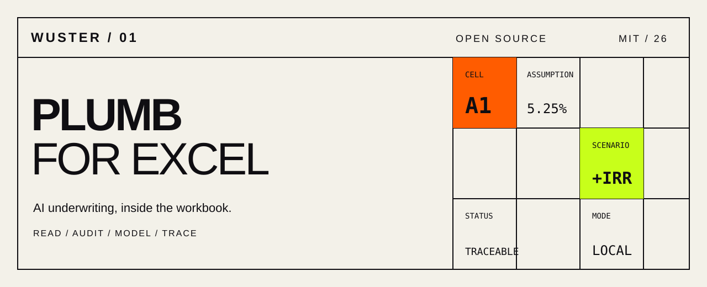
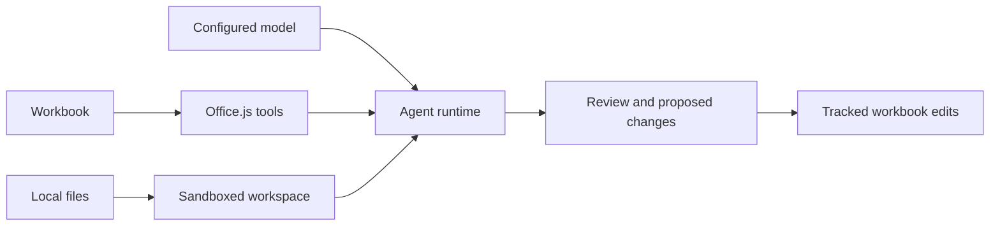

<p align="center">
  
</p>

<p align="center">
  <a href="https://github.com/wusterbuilds/plumb-excel/actions/workflows/ci.yml"></a>
  <a href="LICENSE"></a>
  <a href="CONTRIBUTING.md"></a>
</p>

# Plumb for Excel

Plumb is an open-source Microsoft Excel add-in for reviewing commercial-real-estate pro formas with an AI agent that can read, audit, annotate, and model directly in the workbook.

It is built for analysts, underwriters, and developers who want AI assistance without moving the underwriting workflow out of Excel.

> **Project status:** early-stage and intended for local evaluation. Verify every model output before using it in an investment or credit decision.

## What it can do

- Read unfamiliar pro forma layouts rather than requiring one template.
- Audit assumptions against uploaded documents, local workbooks, and configured web sources.
- Create scenario columns with tracked, reversible cell changes.
- Annotate findings and link citations back to relevant cells.
- Translate data between different pro forma formats.
- Run with your own supported model credentials; workbook and session state stay in the local add-in by default.

## Run it locally

Prerequisites: Node.js 20+, pnpm 9+, and Excel desktop or web.

```bash
git clone https://github.com/wusterbuilds/plumb-excel.git
cd plumb-excel
pnpm install --frozen-lockfile
pnpm dev-server:excel
```

In another terminal:

```bash
pnpm start:excel
```

Open **Settings** in the task pane to configure a model provider. See [`packages/excel/README.md`](packages/excel/README.md) for manual sideloading instructions.

## How it works



| Package | Purpose |
| --- | --- |
| [`@office-agents/sdk`](packages/sdk) | Agent runtime, tools, storage, virtual filesystem, and provider configuration |
| [`@office-agents/core`](packages/core) | Shared React chat and review interface |
| [`@office-agents/excel`](packages/excel) | Excel tools, CRE review agents, citations, and scenario workflow |
| [`@office-agents/file-server`](packages/file-server) | Optional local folder access |

## Safety and data boundaries

- Plumb can modify an open workbook. Use a copy while evaluating it.
- Model requests go to the provider you configure; review that provider's data policy.
- API keys are stored in the browser add-in environment and are never committed by this repository.
- Included document-audit fixtures are synthetic and do not contain customer or third-party report content.
- Data-source connectors shown in the current interface are explicitly labeled simulations; they do not authenticate to or query third-party services.
- This software is not investment, legal, tax, or credit advice.

## Development

```bash
pnpm build
pnpm test
pnpm typecheck
pnpm lint
pnpm validate
```

See [CONTRIBUTING.md](CONTRIBUTING.md) for the contribution workflow and [SECURITY.md](SECURITY.md) for private vulnerability reporting.

## Lineage

Plumb is derived from [Office Agents](https://github.com/hewliyang/office-agents) by [hewliyang](https://github.com/hewliyang). The upstream MIT notice is retained in [LICENSE](LICENSE), with additional attribution in [NOTICE.md](NOTICE.md).

## License

MIT. See [LICENSE](LICENSE).
